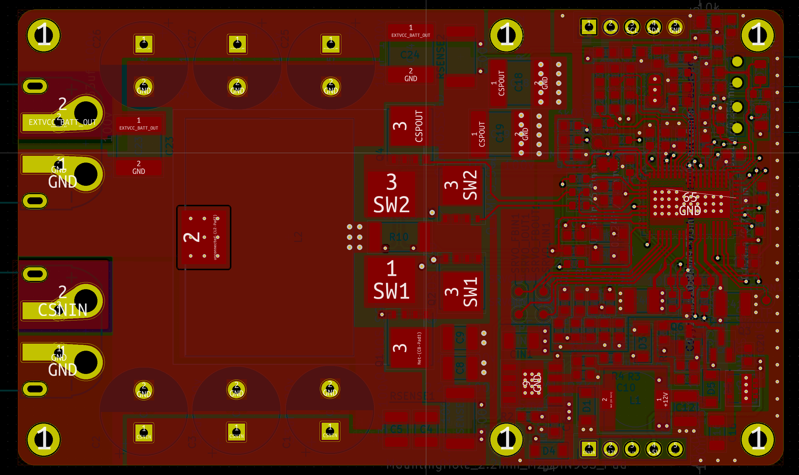

# LT8491 MPPT boosting solar charge controller mainboard

**PCB layout**:

**Description**: This project started out with the goal of reimplementing [Craig Peacock's design](https://circuitmaker.com/Projects/Details/Craig-Peacock-4/LT8490-Buck-Boost-Multi-Chemistry-Battery-Charger-with-MPPT) in KiCad, while also making it more compact;

**Status**: Test PCB assembled: LT8491 starts and communicates over i2C, but performance is unusably poor. Unsure why.

**Features**:

* Auxilary switching power supply to power additional future display board, can be enabled/disabled at runtime for power saving
* As compact as possible while keeping the board single sided
* High performance and efficiency (hopefully)
* XT60 connectors
* 60v max in and out